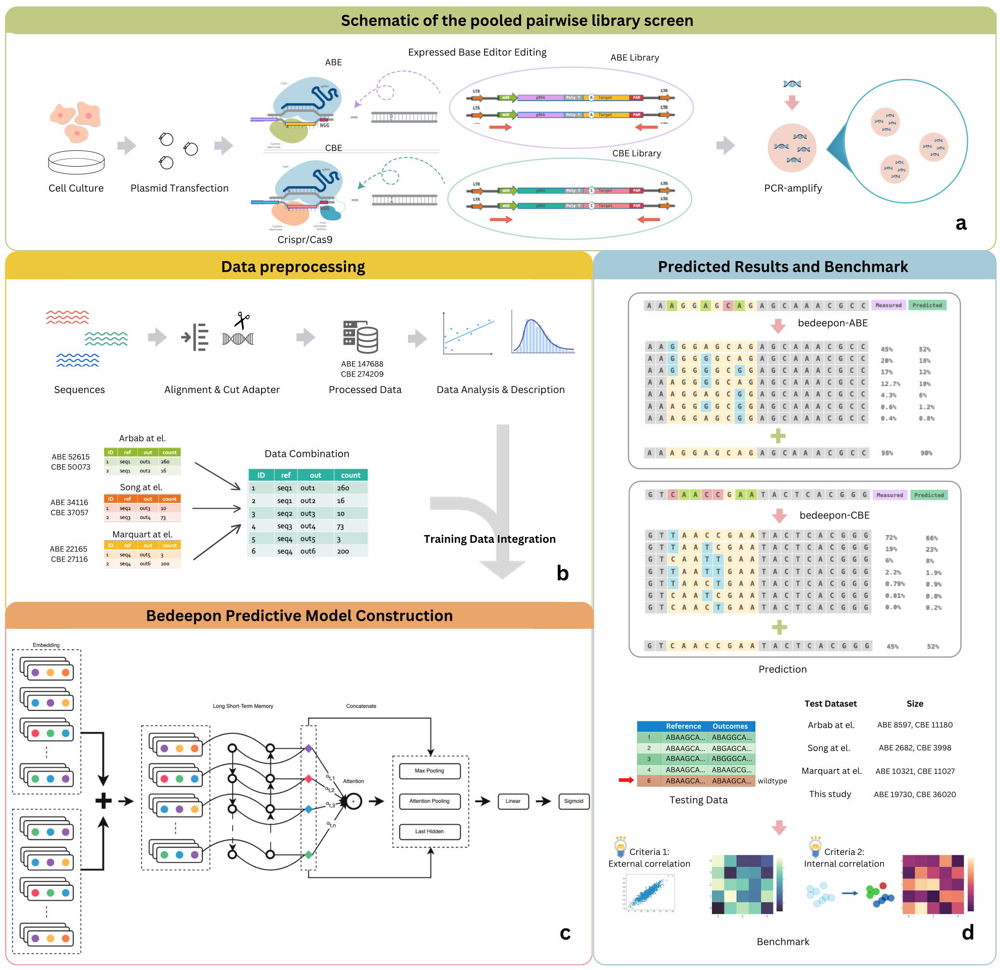

# bedeepon

bedeepon is a tool based on deep learning for predicting editing efficiency and editing outcomes. Although previously there are some relative works on predicting editing outcomes, the flaw and inaccracy of these models can not be ignored. Consequently, a brand new model which improves the shortcomings and provides insights into the mechanisms of editing efficiency via data integration and benchmarking is proposed in this work.

Here os the whole workflow of [bedeepon](https://doi.org/10.1101/2021.03.14.435303):

The workflow includes the following steps:

### 1. Sequence Design

Here we cultured and amplified HEK293T, Hela and other cells with designed plasmids, which contains a delicate structure with over 50 thousand samples of million editable sites.

### 2. Data Processing and Integrating

Considering a combined dataset will enhance the generalization ability of the model, we integrated our training data from different datasets, including Be-hive, DeepBaseEditor and BE-DICT. And also we split the identical testing dataset as the fundamental benchmarking dataset.

### 3. Model Training

We tried to train our deep learning model based on the integrated dataset and launched different trials, including convolutional neural network (CNN), recurrent neural network (RNN) and Long Short-Term Memory (LSTM) models. After our experiments, we found that the BiLSTM model with a small number of filters and a large number of neurons can achieve the best performance.

### 4. Model Evaluation and Benchmarking

Two criterias of evaluation, external correlation and internal correlation, are used to evaluate the model performance of assuming editing efficiency and editing outcomes. Notably, the editing outcomes are measured by both the number of edited sites (edited outcomes, proportion) and the number of non-edited sites (all outcomes, frequency) individualy.